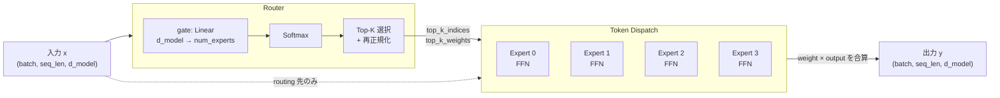
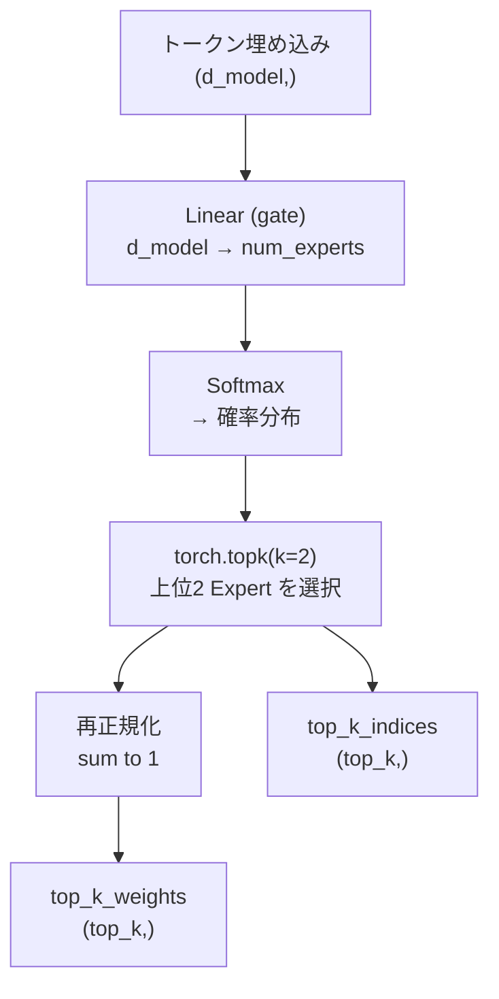
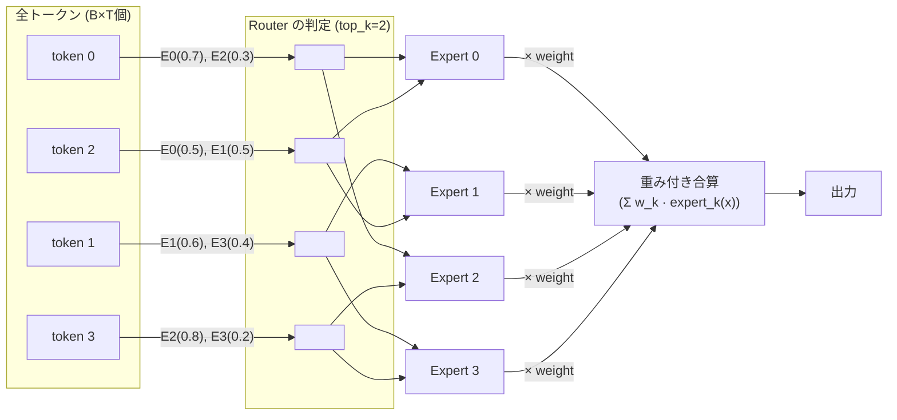
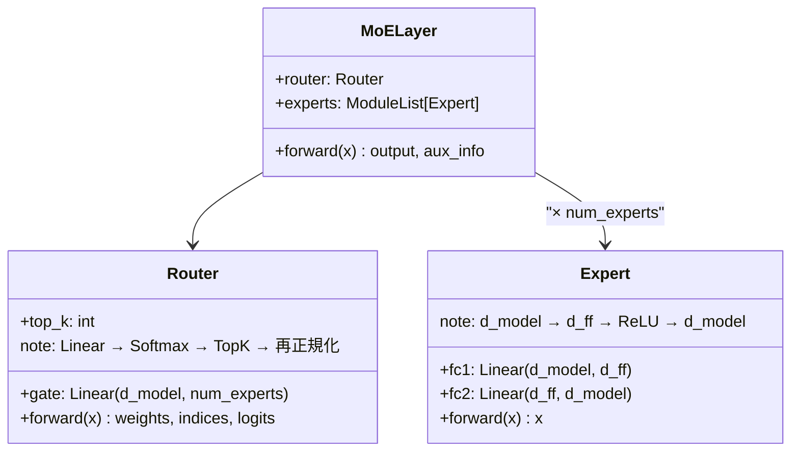

# Mixture of Experts (MoE) — アーキテクチャ解説

## 概要

MoE は「複数の専門家（Expert）の中から、入力に応じて一部だけを選んで使う」アーキテクチャ。
全 Expert を毎回使うのではなく **Top-K 個だけ** 活性化するため、パラメータ数を増やしても計算量を抑えられる。

---

## 全体フロー



---

## Router の詳細

Router が MoE の「頭脳」。各トークンに対して「どの Expert を使うか」を決定する。



### Router の3ステップ

| ステップ | 操作 | 出力shape |
|---|---|---|
| 1. スコア計算 | `gate(x)` — Linear | `(batch, seq_len, num_experts)` |
| 2. 確率化 | `Softmax(dim=-1)` | `(batch, seq_len, num_experts)` |
| 3. Top-K 選択 + 再正規化 | `torch.topk` → 合計1に揃える | `(batch, seq_len, top_k)` × 2 |

---

## Token Dispatch の仕組み

Router が選んだ Expert にトークンを「振り分け」て処理する。



出力の計算式:

$$y = \sum_{k=1}^{K} w_k \cdot \text{Expert}_{i_k}(x)$$

- $w_k$: Router が出したゲート重み（再正規化済み）
- $i_k$: 選ばれた Expert のインデックス
- $K$: top_k（このコードでは 2）

---

## クラス構成



---

## Expert Load とは

理想的には全 Expert が均等にトークンを担当する（**Load Balancing**）。
特定の Expert に集中すると「Expert Collapse」が起き、他の Expert が学習されなくなる。

```mermaid
xychart-beta
    title "Expert Load の例（均等な場合）"
    x-axis ["Expert 0", "Expert 1", "Expert 2", "Expert 3"]
    y-bar [25, 26, 24, 25]
```

実際の学習では **Auxiliary Loss**（補助損失）を加えて偏りを防ぐ。
`router_logits` を返しているのはこの損失計算に使うため。

---

## テンソルの形状まとめ

```
x (入力)           : (batch=2, seq_len=8, d_model=16)
router_logits      : (2, 8, num_experts=4)   ← 生スコア
top_k_weights      : (2, 8, top_k=2)         ← ゲート重み
top_k_indices      : (2, 8, top_k=2)         ← 選ばれた Expert番号
x_flat             : (16, 16)                 ← B×T=16 トークン
output             : (2, 8, 16)              ← 入力と同じ形
```

## moe.py
出力結果
```bash
anch@pancho:~/study/performance_engineering_ai$ uv run src/section3/s0/moe.py
Input shape : torch.Size([2, 8, 16])
Output shape: torch.Size([2, 8, 16])

=== Expert Load (Router の routing 結果) ===
  Expert  0: ████████ (8/32 = 25.0%)
  Expert  1: ██████████ (10/32 = 31.2%)
  Expert  2: █████ (5/32 = 15.6%)
  Expert  3: █████████ (9/32 = 28.1%)

=== Gate Weights (最初の5トークン) ===
  token[0] → Expert3(0.604), Expert0(0.396)
  token[1] → Expert1(0.601), Expert0(0.399)
  token[2] → Expert1(0.507), Expert3(0.493)
  token[3] → Expert0(0.536), Expert2(0.464)
  token[4] → Expert1(0.617), Expert3(0.383)

=== Router Logits (batch=0) ===
tensor([[-0.0480, -0.5440, -0.3730,  0.3740],
        [ 0.3610,  0.7720,  0.1080,  0.0020],
        [ 0.2170,  0.6930,  0.4710,  0.6670],
        [-0.2100, -0.6650, -0.3560, -0.6590],
        [-0.0920,  0.4690, -0.1900, -0.0090],
        [-0.0720,  0.1810, -0.4510,  0.5300],
        [ 0.8050,  0.3110,  0.3390, -0.1310],
        [ 0.6230, -0.0440,  1.0430,  0.1200]])
panch@pancho:~/study/performance_engineering_ai$ 
```